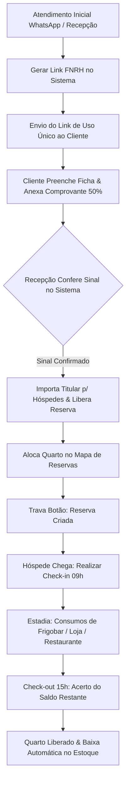

# 🌿 Hotel Fazenda Anew - Sistema de Gestão Hoteleira & FNRH

<div align="center">


**Solução integrada e moderna para gestão hoteleira rural, controle de reservas, mapa interativo, emissão e coleta digital da FNRH (Ficha Nacional de Registro de Hóspedes) com conformidade LGPD, controle financeiro e lojinha da fazenda.**

*Localização: Corguinho - Mato Grosso do Sul (MS) • Brasil*

</div>

---

## 📋 Sumário Executivo

- [1. Visão Geral & Estrutura do Hotel](#1-visão-geral--estrutura-do-hotel)
- [2. Fluxo Operacional Ponta a Ponta](#2-fluxo-operacional-ponta-a-ponta)
- [3. Módulos do Sistema & Regras de Negócio](#3-módulos-do-sistema--regras-de-negócio)
  - [3.1. Dashboard Executivo](#31-dashboard-executivo)
  - [3.2. Links FNRH & Pré-Cadastros](#32-links-fnrh--pré-cadastros)
  - [3.3. Portal do Hóspede (FNRH Digital Pública)](#33-portal-do-hóspede-fnrh-digital-pública)
  - [3.4. Mapa de Reservas Interativo](#34-mapa-de-reservas-interativo)
  - [3.5. Status & Governança dos Quartos](#35-status--governança-dos-quartos)
  - [3.6. Operação de Check-in](#36-operação-de-check-in)
  - [3.7. Operação de Check-out & Acerto de Contas](#37-operação-de-check-out--acerto-de-contas)
  - [3.8. Gestão de Hóspedes & Clientes](#38-gestão-de-hóspedes--clientes)
  - [3.9. Controle Financeiro](#39-controle-financeiro)
  - [3.10. Lojinha da Fazenda & Controle de Estoque](#310-lojinha-da-fazenda--controle-de-estoque)
  - [3.11. Configurações & Políticas Gerais](#311-configurações--políticas-gerais)
- [4. Segurança, LGPD & Auditoria](#4-segurança-lgpd--auditoria)
- [5. Arquitetura Técnica & Stack Tecnológica](#5-arquitetura-técnica--stack-tecnológica)
- [6. Como Executar o Projeto](#6-como-executar-o-projeto)
- [7. Variáveis de Ambiente](#7-variáveis-de-ambiente)

---

## 1. Visão Geral & Estrutura do Hotel

O **Hotel Fazenda Anew** combina o turismo rural com acolhimento e gastronomia típica sul-mato-grossense. Para oferecer excelência no atendimento, o sistema foi projetado sob medida para unificar a recepção, vendas, cozinha e administração.

### 🏡 Acomodações (13 Quartos)
O hotel dispõe de 13 unidades habitacionais distribuídas em três blocos rurais:
- **Bloco B (Quartos Standard):** `B1`, `B2`, `B3`, `B4` — Ideal para casais ou estadias individuais (capacidade padrão de até 2 adultos).
- **Bloco C (Quartos Superiores Triplos):** `C2`, `C3`, `C4` — Acomodações amplas com varanda (capacidade de até 3 adultos).
- **Bloco D (Quartos Luxo / Família Quádruplos):** `D1`, `D2`, `D3`, `D4`, `D5`, `D6` — Suítes espaçosas para famílias (capacidade de até 4 adultos + crianças).

### 🌿 Horários Padrão da Fazenda
- **Check-in:** A partir das `09:00`
- **Check-out:** Até as `15:00`
- **Política de Entrada:** Sinal antecipado de 50% via PIX para garantia da reserva.

---

## 2. Fluxo Operacional Ponta a Ponta



---

## 3. Módulos do Sistema & Regras de Negócio

### 3.1. Dashboard Executivo
*Ponto central de monitoramento em tempo real para a gerência e recepção.*

- **Ocupação em Tempo Real:** Calcula dinamicamente a taxa de ocupação:
  $$\text{Taxa de Ocupação (\%)} = \left(\frac{\text{Quartos Ocupados}}{\text{Total de Quartos Ativos}}\right) \times 100$$
- **Previsões do Dia:** Exibe os check-ins e check-outs agendados para a data corrente do sistema.
- **Censo de Hóspedes Presentes:** Total de pessoas na fazenda (soma de adultos e crianças presentes em quartos com check-in ativo).
- **Alertas de Manutenção e Governança:** Destaque de quartos bloqueados para higienização ou reparos técnicos.

---

### 3.2. Links FNRH & Pré-Cadastros
*Módulo de recepção para geração, acompanhamento e homologação de links da Ficha Nacional de Registro de Hóspedes.*

- **Geração Segura de Token:** O sistema gera um token criptográfico único de 32 caracteres hexadecimais com validade padrão de 7 dias (`token_expira_em`).
- **URL Dinâmica sem Hardcode:** O link é montado utilizando dinamicamente `window.location.origin` (ex: `https://hotelfazendaanew.com.br/fnrh/<token>`), adaptando-se a qualquer ambiente (produção, homologação ou rede local).
- **Integração WhatsApp em 1 Clique:** Botão dedicado que abre o WhatsApp Web/App com mensagem de boas-vindas pré-formatada e o link exclusivo do hóspede.
- **Ciclo de Estados do Cadastro:**
  1. `AGUARDANDO_PAGAMENTO` / `AGUARDANDO_PREENCHIMENTO`: Link gerado e enviado, aguardando o hóspede preencher seus dados e enviar o comprovante.
  2. `PREENCHIDO_AGUARDANDO_SINAL`: O hóspede enviou os dados e o comprovante do sinal; aguarda conferência pela recepção.
  3. `LIBERADA_PARA_RESERVA`: A atendente conferiu o pagamento do sinal de 50% e clicou em *"Confirmar Sinal"*. O titular é automaticamente importado/atualizado na base permanente de hóspedes (`public.hospede`).
  4. `RESERVA_CRIADA`: Uma vez que o quarto é alocado no mapa de reservas, o sistema vincula o `reservaid` ao cadastro e **desabilita permanentemente o botão de criar reserva**, exibindo o badge indicativo para evitar reservas duplicadas acidentais.
  5. `CANCELADA`: O link pode ser cancelado ou expira automaticamente se não for utilizado.

---

### 3.3. Portal do Hóspede (FNRH Digital Pública)
*Interface pública responsiva e otimizada para smartphones onde o cliente preenche sua ficha pré-chegada.*

- **Acesso Sem Necessidade de Senha:** Protegido pelo token de uso único do link.
- **Segurança LGPD:** Após o envio com sucesso da ficha, os dados sensíveis são travados para proteger a privacidade do cliente contra terceiros.
- **Dados Obrigatórios do Titular:** Nome Completo, CPF (com máscara automática), Telefone/WhatsApp, Data de Nascimento, Nacionalidade e Endereço Completo.
- **Gestão de Acompanhantes:** Cadastro de acompanhantes ilimitados.
  > [!IMPORTANT]
  > **Regra para Menores de Idade:** Se o acompanhante for menor de 18 anos, é obrigatório informar o CPF e identificação do responsável legal (exigência do Estatuto da Criança e do Adolescente e Ministério do Turismo).
- **Controle de Veículos:** Coleta de placa e modelo/cor do veículo para agilizar a liberação na portaria da fazenda.
- **Restrições Alimentares & Alergias:** Campo vital para turismo rural, alertando a cozinha sobre celíacos (sem glúten), intolerantes a lactose, vegetarianos, veganos ou alergias a frutos do mar/oleaginosas.
- **Upload de Comprovante de Pagamento:** Envio direto do comprovante de transferência ou PIX do sinal de 50%.
- **Termo de Declaração & Normas:** Aceite obrigatório das regras de convivência, preservação ambiental e veracidade das informações prestadas.

---

### 3.4. Mapa de Reservas Interativo
*Visualização matricial (timeline) de todos os quartos x dias do mês.*

- **Detecção Estrita de Conflito de Quartos:** O sistema bloqueia matematicamente a criação de reservas sobrepostas no mesmo quarto:
  $$\text{Conflito} \iff (\text{Entrada}_A < \text{Saída}_B) \land (\text{Saída}_A > \text{Entrada}_B)$$
- **Políticas de Diárias para Crianças:**
  - **0 a 5 anos:** Isenção total (100% de desconto na diária).
  - **6 a 11 anos:** Meia-diária (50% de desconto).
  - **12 anos ou mais:** Tarifa integral de adulto.
- **Pacotes Promocionais Prontos:**
  - Pacote Fim de Semana (2 diárias - Entrada Sexta, Saída Domingo)
  - Pacote Feriado Prolongado (3 a 4 diárias)
  - Day Use (Uso da estrutura de lazer das 08h às 17h, sem pernoite)
- **Cálculo Financeiro Transparente:** Exibe o total das diárias, o valor de sinal pago e o saldo em aberto a ser cobrado no check-in/check-out.

---

### 3.5. Status & Governança dos Quartos
*Controle do estado físico e operacional de cada acomodação.*

| Status | Cor | Descrição Operacional |
|---|---|---|
| `DISPONIVEL` | 🟢 Verde | Limpo, vistoriado e pronto para ocupação imediata. |
| `RESERVADO` | 🔵 Azul | Aguardando hóspede com reserva futura confirmada. |
| `OCUPADO` | 🟠 Laranja | Hóspede realizou check-in e está hospedado no quarto. |
| `MANUTENCAO` | 🔴 Vermelho | Bloqueado temporariamente com motivo registrado (ex: ar-condicionado, pintura). |
| `LIMPEZA` | 🟡 Amarelo | Aguardando serviço de camareira/higienização pós-saída. |

---

### 3.6. Operação de Check-in
*Fluxo simplificado para a recepção no momento da chegada dos visitantes.*

- Filtro automático de reservas agendadas para a data atual (`dataentrada`).
- Conferência rápida de documentos do titular e acompanhantes.
- Ao confirmar o check-in:
  1. A reserva transiciona de `RESERVADO` para `HOSPEDADO`.
  2. O quarto passa automaticamente de `DISPONIVEL` para `OCUPADO`.
  3. São registradas a data/hora exata e o identificador do atendente.

---

### 3.7. Operação de Check-out & Acerto de Contas
*Fechamento financeiro e liberação física das acomodações.*

- Lista de saídas programadas para o dia (`datasaida`).
- **Extrato Integrado da Conta:**
  - Saldo devedor das diárias contratadas;
  - Adição automática de todos os consumos extras da lojinha, bebidas ou passeios registrados no quarto;
  - Desconto dos pagamentos já efetuados (sinal/adiantamentos).
- **Múltiplas Formas de Pagamento:** Quitação em PIX, Cartão de Crédito, Cartão de Débito ou Dinheiro em Espécie.
- Ao concluir o check-out:
  1. O status da reserva passa para `CONCLUIDA`.
  2. O quarto é desocupado e liberado para `DISPONIVEL` (ou limpeza).
  3. Todos os lançamentos financeiros são consolidados no caixa do dia.

---

### 3.8. Gestão de Hóspedes & Clientes
*Base unificada de clientes com histórico de fidelização e preferências.*

- **Padrão Data Grid Table Profissional:** Exibição tabular estruturada com colunas:
  - **ID:** Código único do hóspede (`#1`, `#2`...);
  - **Hóspede Titular:** Nome completo, CPF formatado (`000.000.000-00`), badge de alerta caso possua restrições alimentares (`⚠️ Restrição`) e observações gerais;
  - **Contato / WhatsApp:** Telefone formatado com botão direto para envio de mensagem no WhatsApp e e-mail;
  - **Localização:** Cidade e Estado (`Campo Grande - MS`, etc.);
  - **Estadias:** Contador consolidado de passagens pelo hotel;
  - **Ações:** Botões compactos de *Editar* e *Excluir*.
- **Paginação Automática (10 Itens por Página):** Navegação rápida com indicador de registros e busca com filtro dinâmico instantâneo.
- **Cadastro Direto pelo Administrador (+ Novo Hóspede):**
  - **1. Dados Pessoais & Documentos:** Nome Completo (obrigatório *), CPF, RG/Órgão Expedidor, Passaporte (para estrangeiros), Data de Nascimento, Gênero, Nacionalidade e Profissão.
  - **2. Contato & Endereço:** Telefone celular (obrigatório *), WhatsApp (com atalho *"Copiar telefone"*), E-mail, **CEP com busca automática integrada via API ViaCEP** (preenche rua, bairro, cidade e estado em tempo real), Endereço completo, Cidade e Seletor de UF.
  - **3. FNRH & Preferências:** Procedência (de onde veio), Próximo Destino, CPF de responsável de menor, Alergias/Restrições Alimentares, Solicitações Especiais (quarto térreo, berço, etc.) e Observações Internas.
- **Integridade Relacional:** O sistema protege a integridade dos dados, impedindo a exclusão de hóspedes vinculados a reservas ativas ou em andamento.

---

### 3.9. Controle Financeiro
*Transparência na saúde financeira do hotel.*

- **Fluxo de Receitas:** Entradas discriminadas por categoria (Hospedagem, Vendas da Lojinha, Day Use e Consumo Extra).
- **Controle de Inadimplência & Saldos:** Relatório claro de valores já pagos versus saldos a receber de reservas futuras.
- **Agrupamento por Método de Pagamento:** Totalizadores por PIX, Cartão e Dinheiro para conferência de caixa.

---

### 3.10. Lojinha da Fazenda & Controle de Estoque
*Comercialização dos produtos artesanais da fazenda.*

- **Produtos Típicos:** Mel silvestre, queijo caipira, doces caseiros, cachaças artesanais, artesanato local e itens de conveniência.
- **Modalidades de Venda:**
  - Venda Avulsa no Balcão (com pagamento imediato);
  - Lançamento em Quarto (Consumo Extra para acerto consolidado no check-out).
- **Baixa Automática de Estoque:** Toda venda reduz o estoque em tempo real; o sistema bloqueia vendas se a quantidade solicitada for superior ao estoque físico.

---

### 3.11. Configurações & Políticas Gerais
*Parametrização das regras de negócio do estabelecimento.*

- Definição do nome fantasia, CNPJ, telefone institucional e e-mail.
- Horários operacionais de check-in e check-out.
- Faixas etárias para gratuidades infantis.
- Percentual mínimo para garantia de reserva (ex: 50% de sinal).
- Chaves de conexão e sincronização com o Supabase.

---

## 4. Segurança, LGPD & Auditoria

- **Conformidade com a LGPD (Lei Geral de Proteção de Dados):**
  - Links de cadastro FNRH possuem validade temporária (7 dias).
  - Após o envio da ficha pelo hóspede, o link impede o acesso público posterior aos dados sensíveis preenchidos.
  - Termo de consentimento e aceite de privacidade registrado com data e hora.
- **Auditoria Completa no Banco de Dados:**
  - Todas as tabelas principais (`reserva`, `hospede`, `quarto`, `produto`, `consumo_extra`, `pagamento`) possuem rastreabilidade com:
    - `datainclusao` e `usuarioinclusao`
    - `dataoperacao` e `usuariooperacao`
    - `naturezaoperacao` (`INSERT`, `UPDATE`, `DELETE`)
    - `ativo` (soft-delete para preservação de histórico fiscal e hoteleiro).

---

## 5. Arquitetura Técnica & Stack Tecnológica

### Frontend
- **[React 19](https://react.dev/):** Biblioteca moderna para construção de interfaces reativas de alta performance.
- **[TypeScript 5.8](https://www.typescriptlang.org/):** Tipagem estática rigorosa para garantir estabilidade e prevenção de bugs.
- **[Vite 6.4](https://vitejs.dev/):** Ferramenta de build de última geração com HMR instantâneo.
- **[Tailwind CSS 4.1](https://tailwindcss.com/):** Estilização moderna com design system exclusivo nas cores da Fazenda Anew (`#053d1e`).
- **[Lucide React](https://lucide.dev/):** Pacote de ícones vetoriais leves e consistentes.

### Backend & Persistência
- **[Supabase](https://supabase.com/):** Backend-as-a-Service com PostgreSQL gerenciado.
- **PostgreSQL Database:** Banco de dados relacional com integridade referencial estrita, constraints, views e triggers.
- **ViaCEP API:** Consulta assíncrona de endereços brasileiros por CEP.

### Estrutura de Diretórios

```
sistema-hotel-fazenda-anew/
├── src/
│   ├── componentes/
│   │   ├── comuns/            # Componentes visuais genéricos (Logo, Modais de Confirmação)
│   │   ├── fnrh/              # Modais de Links FNRH (Gerar, Detalhes, Confirmar Sinal)
│   │   ├── hospedes/          # Modal completo de criação/edição de Hóspede
│   │   ├── layout/            # Barra lateral, Barra superior e navegação
│   │   ├── mapa-reservas/     # Grade matricial e modais de reserva rápida
│   │   ├── quartos/           # Cards e modais de quartos
│   │   └── reservas/          # Componentes de listagem e filtro de reservas
│   ├── contextos/
│   │   └── ContextoHotel.tsx  # Estado global da aplicação (Quartos, Reservas, Hóspedes, etc.)
│   ├── lib/
│   │   └── supabaseCliente.ts # Inicialização e configuração do cliente Supabase
│   ├── paginas/
│   │   ├── PaginaDashboard.tsx        # Dashboard executivo
│   │   ├── PaginaFnrhAdmin.tsx        # Gestão de Links FNRH
│   │   ├── PaginaCadastroFnrh.tsx     # FNRH Digital do Hóspede (/fnrh/:token)
│   │   ├── PaginaReservas.tsx         # Mapa e Gestão de Reservas
│   │   ├── PaginaQuartos.tsx          # Status dos Quartos
│   │   ├── PaginaCheckin.tsx          # Operação de Check-in
│   │   ├── PaginaCheckout.tsx         # Operação de Check-out
│   │   ├── PaginaHospedes.tsx         # Data Grid de Hóspedes
│   │   ├── PaginaFinanceiro.tsx       # Financeiro e Caixa
│   │   ├── PaginaVendas.tsx           # Lojinha e Estoque
│   │   └── PaginaConfiguracoes.tsx    # Configurações do Sistema
│   ├── servicos/
│   │   ├── conflitoReservas.ts        # Algoritmo de validação de datas e sobreposição
│   │   └── supabase/                  # Camada de comunicação com o Supabase (FnrhService, etc.)
│   ├── tipos/
│   │   └── index.ts                   # Interfaces e types TypeScript de todo o domínio
│   └── utilitarios/
│       └── formatadores.ts            # Máscaras de CPF, Telefone, CEP, Moeda e Datas
├── supabase/
│   └── migrations/                    # Scripts SQL de schema, tabelas e migrações
├── package.json
└── README.md
```

---

## 6. Como Executar o Projeto

### Pré-requisitos
- **Node.js:** Versão 18.x ou superior recomendada.
- **Gerenciador de Pacotes:** `npm` ou `pnpm` ou `yarn`.

### Passo a Passo

1. **Clonar o Repositório:**
   ```bash
   git clone https://github.com/FranciscoJhonny/sistema-hotel-fazenda-anew.git
   cd sistema-hotel-fazenda-anew
   ```

2. **Instalar as Dependências:**
   ```bash
   npm install
   ```

3. **Configurar as Variáveis de Ambiente:**
   Crie um arquivo `.env` na raiz do projeto com as chaves do seu projeto Supabase:
   ```env
   VITE_SUPABASE_URL=https://sua-url-projeto.supabase.co
   VITE_SUPABASE_ANON_KEY=sua-chave-anon-publica
   ```

4. **Executar em Modo de Desenvolvimento:**
   ```bash
   npm run dev
   ```
   Acesse a aplicação em `http://localhost:3000` (ou na porta informada pelo Vite).

5. **Checagem de Tipos & Linting:**
   ```bash
   npm run lint
   ```

6. **Gerar Build de Produção:**
   ```bash
   npm run build
   ```

---

## 7. Variáveis de Ambiente

| Variável | Obrigatória | Descrição |
|---|---|---|
| `VITE_SUPABASE_URL` | Sim | URL da API do projeto no Supabase (ex: `https://xyz.supabase.co`). |
| `VITE_SUPABASE_ANON_KEY` | Sim | Chave de API pública (Anon Key) para consumo seguro pelo frontend. |

---

<div align="center">

**Hotel Fazenda Anew** • Hospitalidade, Natureza e Eficiência  
*Desenvolvido para proporcionar a melhor experiência hoteleira no Pantanal e Cerrado.*

</div>
