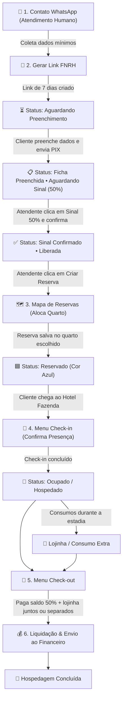

# 🏨 Guia Operacional de Fluxo: Do Atendimento ao Check-out
**Sistema Hotel Fazenda Anew**

Este documento descreve de forma simples, visual e didática o passo a passo que a equipe de recepção/atendimento realiza no **Sistema Hotel Fazenda Anew**, desde o primeiro contato via WhatsApp até o fechamento financeiro no Check-out.

---

## 📊 1. Fluxograma do Processo (Visão Geral)

---

## 📝 2. Passo a Passo Detalhado para a Atendente

### 📱 Passo 1: Atendimento Inicial via WhatsApp & Coleta de Dados
- **Cenário**: O cliente entra em contato pelo WhatsApp do hotel. Como a automação (bot) pode apresentar instabilidades ou mensagens desnecessárias, a atendente assume o atendimento direto.
- **Ação da Atendente**: Coletar os **dados mínimos** para iniciar o processo:
  1. **Nome Completo**
  2. **Telefone / WhatsApp**
  3. **E-mail**
  4. **Data de Entrada (Check-in) e Data de Saída (Check-out)**
  5. **Quantidade de Hóspedes** (Adultos e Crianças)

---

### 🔗 Passo 2: Geração do Link FNRH (Pré-Cadastro)
1. No sistema, acesse a aba **"Links FNRH & Pré-Cadastros"**.
2. Clique no botão **"Gerar Novo Link FNRH"**.
3. Preencha a modal com os dados mínimos coletados e salve.
4. O sistema gera um link com token único válido por **7 dias**.
5. O cadastro entra na lista com o status: **`Aguardando Preenchimento`**.
6. Clique no botão de enviar via WhatsApp ou copiar link e envie ao cliente.

---

### 💳 Passo 3: Preenchimento pelo Hóspede & Envio do Sinal PIX (50%)
1. O hóspede abre o link no smartphone, preenche a Ficha Nacional de Registro de Hóspedes (FNRH) com seus dados completos (documento, endereço, acompanhantes) e aceita os termos.
2. O hóspede efetua o pagamento do **sinal de 50% via PIX** e envia o comprovante para a atendente.
3. No painel do sistema, o cadastro muda de status para:  
   **`Ficha Preenchida • Aguardando Sinal (50%)`**.

---

### ✅ Passo 4: Confirmação do Sinal (50%)
1. A atendente verifica o comprovante PIX recebido.
2. Na lista de cadastros, clica no botão **"Sinal 50%"**.
3. Na janela modal, confirma o **valor do sinal** (ex: R$ 500,00) e pode informar o código da transação/observações.
4. O status atualiza para: **`Sinal Confirmado • Liberada`**.

---

### 🗺️ Passo 5: Criação da Reserva & Alocação de Quarto
1. Com o status liberado, o botão **"Criar Reserva"** fica disponível.
2. A atendente clica em **"Criar Reserva"**, e o sistema redireciona os dados para o **Mapa de Reservas**.
3. A atendente escolhe o melhor quarto para acomodar o hóspede/família no mapa visual.
4. Ao salvar a reserva no quarto desejado:
   - O quarto fica com a faixa **Azul** e status **`Reservado`**.
   - O agendamento fica garantido no calendário do hotel.

---

### 🔑 Passo 6: Chegada do Hóspede & Check-in
1. No dia do Check-in, a reserva fica visível na aba/menu **Check-in**.
2. Quando a família/hóspede chega à recepção da fazenda, a atendente clica em **"Realizar Check-in"** para confirmar a presença.
3. O status da acomodação muda para **`Ocupado`**, e a reserva avança automaticamente para o menu de **Check-out** (estadias em andamento).

---

### 🛒 Passo 7: Consumo Extra (Lojinha) & Check-out Financeiro
1. **Durante a Estadia**: Consumos na lojinha, bebidas ou passeios extras podem ser lançados diretamente na comanda da reserva.
2. **Na Saída (Menu Check-out)**:
   - A atendente acessa o menu **Check-out** e seleciona o quarto.
   - O sistema calcula automaticamente:
     - **Saldo de Hospedagem Pendente** (os 50% restantes).
     - **Consumos de Lojinha / Extras**.
   - **Opções de Pagamento**:
     - O hóspede pode pagar a lojinha separadamente e o saldo da hospedagem depois.
     - Ou pagar o valor total acumulado (Saldo Hospedagem + Lojinha) de uma só vez.
3. Após registrar os pagamentos e clicar em **"Finalizar Check-out"**:
   - O quarto é liberado para limpeza/manutenção.
   - Todo o histórico financeiro (Sinal 50% + Saldo 50% + Consumos) é computado no módulo **Financeiro**.

---

## 📌 3. Resumo Visual de Status do Link FNRH

| Status no Sistema | Significado | Próxima Ação da Atendente |
| :--- | :--- | :--- |
| **`Aguardando Preenchimento`** | Link gerado e enviado ao cliente. | Aguardar o cliente preencher a ficha FNRH. |
| **`Ficha Preenchida • Aguardando Sinal`** | Cliente preencheu a ficha e mandou comprovante PIX. | Conferir PIX e clicar no botão **"Sinal 50%"**. |
| **`Sinal Confirmado • Liberada`** | Sinal de 50% verificado e baixado com sucesso. | Clicar em **"Criar Reserva"** e escolher o quarto. |
| **`Reserva Criada`** (`Reservado` - Azul) | Reserva vinculada ao quarto no Mapa de Reservas. | Aguardar o dia da chegada do hóspede. |

---

> [!TIP]
> **Dica Operacional**: Em momentos de grande fluxo no WhatsApp, priorize a solicitação rápida dos **5 dados mínimos** para já gerar o link FNRH. Deixe o preenchimento detalhado de documentos e acompanhantes por conta do próprio hóspede através do formulário digital!
